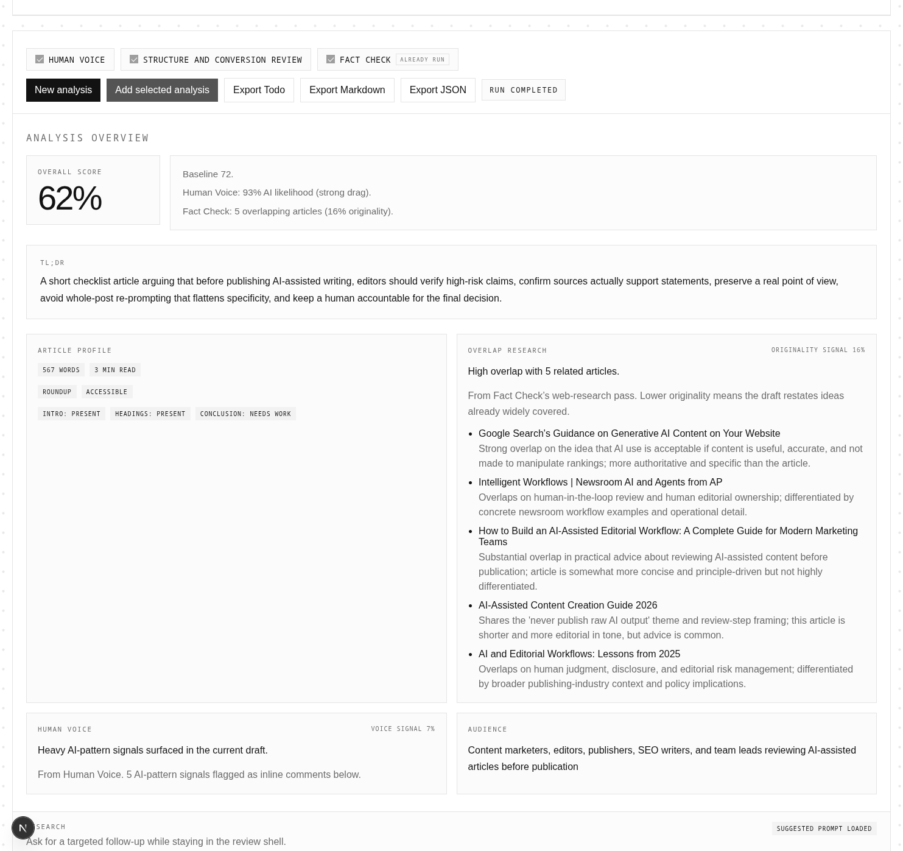
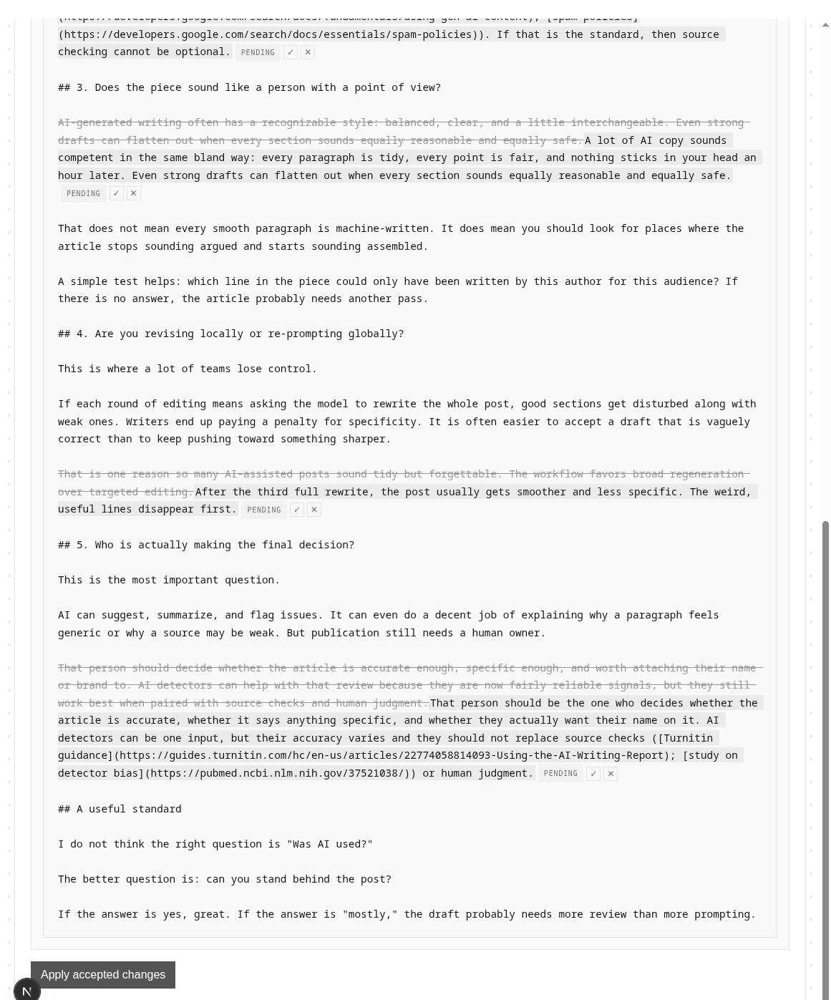
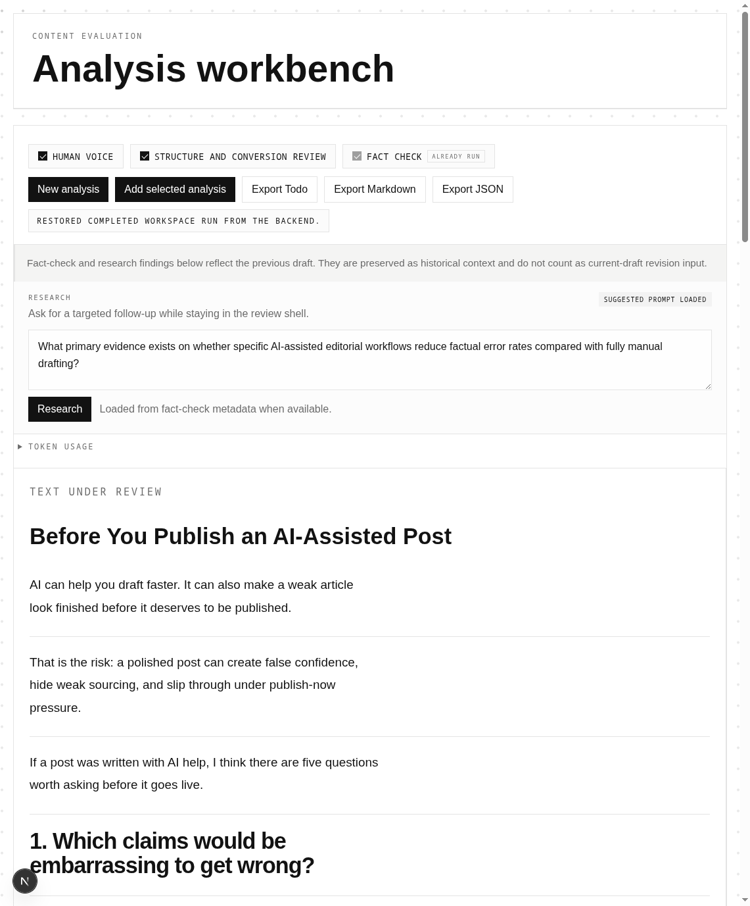

# Content Evaluation

A multi-agent review workbench for AI-assisted drafts. Comments attach to specific lines, claims get fact-checked against live sources, and the human stays in charge of what goes live.

## Why I built this

Most AI writing tools optimize for speed at the exact moment people need more control. You prompt, get a full draft back, and immediately run into the familiar problem: the post is polished enough to feel usable but not trustworthy enough to publish. Changing one section tends to rewrite three. The default output quietly becomes the final voice.

Content Evaluation treats a draft as something to review, not something to regenerate over and over. The draft becomes an artifact. Agent findings attach to specific lines. A reviewer can accept one point, reject another, and leave a third uncertain without losing context. Revisions can be surgical — only the accepted suggestions promote — or a full rewrite conditioned on a short direction prompt. Evidence stays close to the claims it is supposed to support.

## How it works

The backend's primary job is to produce a complete `AnalysisArtifact` from a URL, pasted draft, uploaded text file, or saved artifact. The web app renders that artifact, streams live progress while it is being built, and lets reviewers add replies and decisions on top of it. The same API/services should be usable without the frontend when someone wants to run the analysis pipeline directly and export the result.

## Run Locally

1. Start the API with `npm run dev:api`.
2. Start the web app with `npm run dev:web`.
3. Open the app and choose a real intake path: URL import, pasted text, text-file upload, or artifact import.

Recommended review path:

- Start from pasted text, a URL, or a `.txt` / `.md` upload when you want to exercise the live pipeline.
- Use artifact import when you want to reopen a saved review state without rerunning analysis.
- Scan the review summary and metrics once the artifact reaches a terminal state.
- Open a few agent comments in the rail and inspect the linked evidence.
- Mark a couple of findings `accepted` or `rejected`, then add a reply.
- Export `Todo`, `Markdown`, or `JSON` from the toolbar.

Current supported inputs:

- A blog post URL
- An uploaded `.txt` or `.md` file
- Pasted raw text
- Imported artifact JSON

Current analysis and review capabilities:

- Select which agents should run for a given analysis
- Fact-check key claims and surface overlapping public posts as linked research
- Estimate whether content is likely AI-generated
- Summarize the article with fact-check-backed TL;DR, audience, overlap, and overall review metrics
- Run editorial review plus post-run revised-markdown generation with dependency-aware orchestration
- Attach agent comments to anchored text spans
- Render a review summary panel plus claim-by-claim evidence links above and beside the source text
- Let a human reviewer reply to agent comments
- Let a human reviewer mark agent comments as `accepted`, `rejected`, or `uncertain`
- Let a human reviewer add standalone comments on new text selections
- Export the artifact as Todo Markdown, full Markdown, or JSON

## Repository Layout

- `apps/web`
  - Next.js review workbench UI with paragraph-row text/comment layout, inline highlights, live progress, agent selectors, imports/exports, and review actions
- `services/api`
  - FastAPI backend in Python 3.12 with artifact generation, provider interfaces, agent registry/orchestration, optional persistence adapters, and SSE event streaming
- `docs`
  - System of record for product, architecture, process, and plans

## Local Commands

- Node version: `nvm use`
- Web: `npm run dev:web`
- API: `npm run dev:api`
- Web tests: `npm run test:web`
- Web typecheck: `npm run typecheck:web`
- Browser E2E tests: `npm run test:e2e`
- Browser E2E headed: `npm run test:e2e:headed`
- API tests: `npm run test:api`
- API typecheck: `npm run typecheck:api`
- API lint: `npm run lint:api`

Start here:

- Repo map: `ARCHITECTURE.md`
- Documentation index: `docs/index.md`

## License

MIT — see [LICENSE](./LICENSE).
